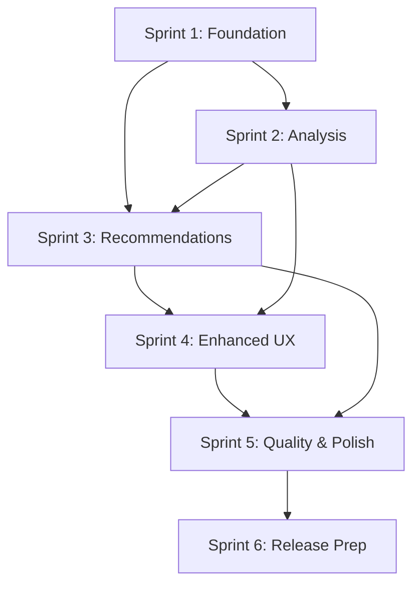

# GitHub Milestones Configuration

This document defines the milestone structure for release planning and sprint management.

## Release Milestones

### v1.0-alpha (MVP Release)
**Target Date**: 6 weeks from project start  
**Description**: Minimum Viable Product with core functionality  
**Story Points**: 45

**Core Features**:
- Database connection and authentication
- Content extraction from Notion pages
- Basic semantic analysis and similarity calculation
- NLP-based tag generation
- Link recommendation engine
- Comprehensive backup system
- Dry-run preview capabilities
- Basic CLI interface

**Success Criteria**:
- Successfully process 1000+ page databases
- Generate meaningful tags for 90%+ of pages
- Identify relevant cross-links with 80%+ accuracy
- Zero data loss incidents
- Complete operations within performance targets

### v1.0-beta (Feature Complete)
**Target Date**: 10 weeks from project start  
**Description**: Feature-complete version with enhanced UX  
**Story Points**: 42 (additional)

**Additional Features**:
- Enhanced approval workflows (per-change, per-page, batch)
- Intelligent link placement in content
- Advanced configuration management
- Change tracking and selective rollback
- Rich CLI interface with progress indicators
- LLM-enhanced tag generation (optional)

**Success Criteria**:
- User satisfaction rating 8/10+
- 95% successful completion rate
- Support for diverse database structures
- Comprehensive documentation coverage

### v1.0 (Production Release)
**Target Date**: 12 weeks from project start  
**Description**: Production-ready release with full documentation  
**Story Points**: 0 (polish and documentation)

**Final Activities**:
- Performance optimization and testing at scale
- Comprehensive documentation and user guides
- Security audit and vulnerability assessment
- Cross-platform testing (Windows, macOS, Linux)
- Installation and packaging improvements

**Success Criteria**:
- Performance at scale (10k+ pages)
- Zero critical or high-severity security issues
- Complete user and developer documentation
- Automated testing coverage 90%+

## Sprint Milestones

### Sprint 1: Foundation (Weeks 1-2)
**Target Date**: 2 weeks from project start  
**Story Points**: 16

**Focus**: Core infrastructure and database integration
**Key Stories**: US-001, US-002, US-003, US-004, US-009

**Deliverables**:
- Notion API integration with error handling
- Environment and configuration system
- Content extraction pipeline
- Basic backup system
- Project structure and development environment

### Sprint 2: Analysis Engine (Weeks 3-4)
**Target Date**: 4 weeks from project start  
**Story Points**: 18

**Focus**: Content analysis and semantic processing
**Key Stories**: US-005, US-006, US-007, US-012, US-010

**Deliverables**:
- Text processing and cleaning pipeline
- Semantic embedding generation
- Similarity matrix calculation
- NLP-based tag generation
- Dry-run preview system

### Sprint 3: Recommendations (Weeks 5-6)
**Target Date**: 6 weeks from project start  
**Story Points**: 13

**Focus**: Link recommendations and CLI interface
**Key Stories**: US-015, US-013, US-018, US-008

**Deliverables**:
- Link recommendation engine
- Tag quality control and review
- Rich CLI interface with progress indicators
- Content analysis caching system

### Sprint 4: Enhanced UX (Weeks 7-8)
**Target Date**: 8 weeks from project start  
**Story Points**: 16

**Focus**: User experience and workflow management
**Key Stories**: US-019, US-016, US-020, US-011

**Deliverables**:
- Flexible approval workflows
- Intelligent link placement
- Advanced configuration management
- Change tracking database

### Sprint 5: Quality & Polish (Weeks 9-10)
**Target Date**: 10 weeks from project start  
**Story Points**: 13

**Focus**: Quality assurance and advanced features
**Key Stories**: US-021, US-014, US-017

**Deliverables**:
- Rollback and recovery system
- Enhanced tag generation with LLM
- Link quality assessment
- Performance optimization

### Sprint 6: Release Preparation (Weeks 11-12)
**Target Date**: 12 weeks from project start  
**Story Points**: 8

**Focus**: Documentation, testing, and release preparation
**Activities**: 
- Comprehensive testing at scale
- Documentation completion
- Security audit
- Cross-platform verification
- Installation and packaging

## Sprint Planning Guidelines

### Sprint Duration
- **Length**: 2 weeks
- **Capacity**: ~20 story points per sprint (adjustable based on team velocity)
- **Buffer**: Include 10-15% buffer for unexpected issues

### Sprint Goals
Each sprint should have:
- Clear, measurable objective
- 3-5 key user stories
- Demo-ready deliverables
- Risk mitigation for blockers

### Milestone Criteria

#### Ready for Sprint Planning
- All stories have acceptance criteria
- Dependencies are identified and resolved
- Story points are estimated
- Technical approach is understood

#### Sprint Success Criteria
- All committed stories are completed
- All acceptance criteria are met
- Code quality standards are maintained
- Demo preparation is complete

#### Release Readiness Criteria
- All milestone stories are completed
- Non-functional requirements are met
- Documentation is current and complete
- Security and performance standards are met

## Risk Management by Milestone

### High-Risk Milestones
**v1.0-alpha (MVP)**: 
- Risk: Core functionality gaps
- Mitigation: Focus on working end-to-end pipeline

**Sprint 2 (Analysis Engine)**:
- Risk: Performance issues with large datasets
- Mitigation: Early performance testing and optimization

**Sprint 4 (Enhanced UX)**:
- Risk: Complex workflow requirements
- Mitigation: User feedback and iterative design

### Milestone Dependencies



### Success Metrics by Milestone

#### Technical Metrics
- **Code Coverage**: 90%+ by v1.0-beta
- **Performance**: Process 1000 pages < 10 minutes by v1.0-alpha  
- **Reliability**: 99.9% success rate by v1.0
- **Security**: Zero high-severity issues by v1.0

#### User Experience Metrics
- **Usability**: Complete workflow in < 5 commands
- **Error Handling**: Clear error messages with resolution steps
- **Documentation**: Complete user guides and troubleshooting
- **Satisfaction**: 8/10+ user rating by v1.0

#### Business Metrics
- **Value Delivery**: 80% of pages get relevant recommendations
- **Efficiency**: 50% reduction in manual linking time
- **Quality**: 90% of generated tags are accepted by users
- **Adoption**: Support for diverse Notion database structures

## Milestone Management Commands

### Create Milestones with GitHub CLI

```bash
# Release milestones
gh api repos/:owner/:repo/milestones -f title="v1.0-alpha (MVP)" -f description="Minimum Viable Product with core functionality" -f due_on="2025-09-22T23:59:59Z"
gh api repos/:owner/:repo/milestones -f title="v1.0-beta (Feature Complete)" -f description="Feature-complete version with enhanced UX" -f due_on="2025-10-20T23:59:59Z"
gh api repos/:owner/:repo/milestones -f title="v1.0 (Production)" -f description="Production-ready release" -f due_on="2025-11-03T23:59:59Z"

# Sprint milestones
gh api repos/:owner/:repo/milestones -f title="Sprint 1: Foundation" -f description="Core infrastructure and database integration" -f due_on="2025-08-25T23:59:59Z"
gh api repos/:owner/:repo/milestones -f title="Sprint 2: Analysis Engine" -f description="Content analysis and semantic processing" -f due_on="2025-09-08T23:59:59Z"
gh api repos/:owner/:repo/milestones -f title="Sprint 3: Recommendations" -f description="Link recommendations and CLI interface" -f due_on="2025-09-22T23:59:59Z"
gh api repos/:owner/:repo/milestones -f title="Sprint 4: Enhanced UX" -f description="User experience and workflow management" -f due_on="2025-10-06T23:59:59Z"
gh api repos/:owner/:repo/milestones -f title="Sprint 5: Quality & Polish" -f description="Quality assurance and advanced features" -f due_on="2025-10-20T23:59:59Z"
gh api repos/:owner/:repo/milestones -f title="Sprint 6: Release Preparation" -f description="Documentation, testing, and release prep" -f due_on="2025-11-03T23:59:59Z"
```

Note: Adjust dates based on actual project start date.